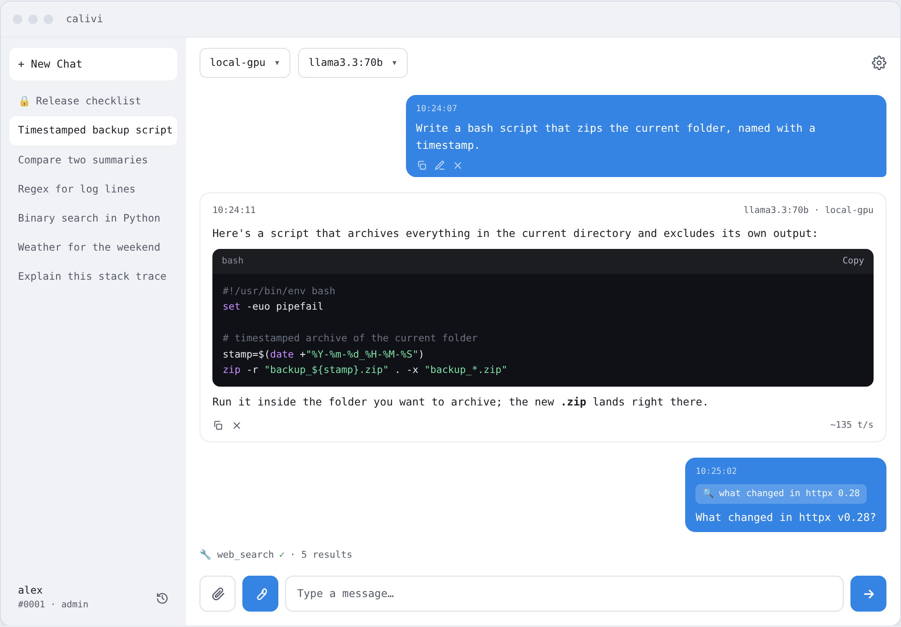

# calivi

A self-hosted, multi-user chat interface for Ollama and OpenAI-compatible servers.
You pick which model runs where: the server first, then the model on it.

Your own GPU box, Ollama Cloud, OpenRouter, Moonshot, LM Studio, vLLM,
llama.cpp-server — all from the same chat window.

<p align="center">
  <picture>
    <source media="(prefers-color-scheme: dark)" srcset="docs/images/app-dark.png">
    
  </picture>
</p>

<p align="center"><sub>The interface, rendered with placeholder data — not a real conversation.</sub></p>

```
┌──────────────┐     ┌──────────────┐     ┌────────────────────────┐
│   Browser    │────▶│ nginx (:8090)│────▶│ FastAPI backend        │
└──────────────┘     │  SPA + /api  │     │  SQLite · tool loop ·  │
                     └──────────────┘     │  approvals             │
                                          └───────────┬────────────┘
                                                      │
              ┌───────────────┬───────────────────────┼───────────────┐
              ▼               ▼                       ▼               ▼
        Ollama servers  OpenAI-compatible      SearXNG (bundled)   MCP servers
        (LAN / remote)  API (cloud / local)    web search          ├─ HTTP, direct
                                                                   └─ stdio, through
                                                                      the sandboxed
                                                                      bridge container
```

> ### ⚠️ Heavy development — use at your own risk
>
> Calivi works today and it is what I use daily, but it is under **heavy development**.
> Things break between commits, defaults change, and security holes get found and closed
> as the code moves. There is no stable release channel, no versioned upgrade path, and no
> guarantee that today's database survives tomorrow's migration untouched.
>
> If you run it: **watch the commits, update often, and keep your own backups.** Read the
> diff before you pull. **Use at your own risk.**

---

## Highlights

- **Multi-server, manual selection** — You choose the server and model from the top bar;
  no automatic routing. Only reachable (`up`) servers appear in the picker.
- **Two server types** — `ollama` (native `/api/chat`) and `openai` (OpenAI-compatible
  `/v1/chat/completions`). One interface drives both.
- **Streaming with reasoning** — Responses stream in; reasoning models' thinking tokens
  are shown in a separate box. Interrupt with the **Stop** button or **Esc** (whatever
  was generated so far is kept).
- **Multi-user** — httpOnly cookie + JWT sessions, admin/user roles. Each user sees only
  their own chats. Registration can be closed by an admin.
- **Vision** — Send images to vision-capable models, including paste-from-clipboard and a
  full-screen viewer (lightbox).
- **Document attachments** — PDF / docx / txt / code / csv / json are extracted as
  **text** and handed to the model (lossless text, not OCR).
- **Tools (🔧)** — One toggle in the composer offers the tool layer to the model, which then
  calls tools *on its own initiative*; which tool ran is visible in the conversation and
  survives a reload. Bundled SearXNG provides web search.
- **MCP servers** — Connect [Model Context Protocol](https://modelcontextprotocol.io) servers
  (Context7, GitHub, Exa…) and their tools become available to the model alongside the built-in
  ones. HTTP servers directly; stdio servers through a bundled, sandboxed bridge container.
- **Approval before anything changes** — Read-only tools run on their own; a tool that can change
  something is **off until you enable it**, and then it asks you before every single run. Silence
  is a denial, never consent.
- **Secrets encrypted at rest** — MCP tokens and provider API keys are encrypted in the database,
  so a copy of it (a backup, a stolen volume) does not hand over your credentials.
- **Message editing** — Edit a message and either **Update** (regenerate from that point,
  optionally on a different model) or **New chat** (branch while keeping history).
- **Every answer accounted for** — Each reply carries the model and the server that produced it
  and the tokens/sec it ran at, stored with the message so they survive a reload — a chat you
  came back to still tells you what answered, where, and how fast. Copy any single answer, or
  the whole conversation, to the clipboard in one click; delete a message to walk the chat back.
- **Markdown + math** — Code blocks with copy buttons, tables, KaTeX.
- **9 languages** — TR, EN, DE, ES, IT, PT, RU, JA, ZH.
- **Light/dark theme** with a selectable accent color.

---

## Installation

**Requirements:** Docker and Docker Compose. Nothing else.

```bash
git clone https://github.com/orkun-soylu/calivi.git
cd calivi
docker compose up -d --build
```

Open **http://localhost:8090** (or the host's LAN address: `http://192.168.x.x:8090`).

> **The first person to sign up becomes the admin.** Create the first account from the
> registration screen — it is the **super admin** (id 1) and cannot be deleted or
> demoted. Later sign-ups become regular users; you can close registration entirely
> under Settings → General.

### Adding a server

Settings (⚙) → **Servers** → use the form at the bottom:

| Type | Fields | Example |
|---|---|---|
| `ollama` | host + port | `192.168.1.50` : `11434` |
| `openai` | base URL + API key | `https://openrouter.ai/api/v1` |

The model list is fetched automatically (`/api/tags` or `/v1/models`). A green light on
the row means the server is reachable; red servers are hidden from the chat picker.

> **Ollama must be reachable over the network.** By default Ollama listens only on
> `127.0.0.1`. To reach it from another machine, run it with `OLLAMA_HOST=0.0.0.0`.

### Adding an MCP server

Settings (⚙) → **MCP** → presets for Context7, GitHub and Exa prefill the URL and the auth
header, or fill the form yourself. A green light means the handshake succeeded; the row
expands to show which tools were registered — each with a checkbox, so individual tools can be
switched off without removing the server.

Turn the **🔧 toggle** on in the composer for any of it to reach the model: it gates the whole
tool layer, web search and MCP alike.

| Server | URL | Auth |
|---|---|---|
| Context7 | `https://mcp.context7.com/mcp` | `CONTEXT7_API_KEY` header — optional, raises rate limits |
| GitHub | `https://api.githubcopilot.com/mcp/readonly` | `Authorization: Bearer <PAT>` |
| Exa | `https://mcp.exa.ai/mcp` | `Authorization: Bearer <key>` |

Transport is **HTTP** — either Streamable HTTP or the older HTTP+SSE (pick `SSE` for servers
like Linear that still serve it). For stdio servers (`npx …`), see below.

### stdio MCP servers — the bundled bridge

Calivi never runs stdio servers itself: that would execute an npm or PyPI package named in a web
form inside the backend container, next to the database and the session key. A bundled, opt-in
bridge container runs them instead and speaks HTTP to Calivi.

```bash
cp stdio-bridge/servers.example.json stdio-bridge/servers.json
# add your servers to stdio-bridge/Dockerfile (pinned) and to servers.json
docker compose --profile stdio-bridge up -d --build
```

Then add it in Settings → MCP like any other server, transport **HTTP**, no secret:

```
http://calivi-mcp-bridge:8096/servers/time/mcp
```

The example ships `mcp-server-time`, which answers the question models are worst at — what the
date is right now.

**Servers are installed into the image, pinned** (`stdio-bridge/Dockerfile`), each in its own
virtualenv. Do not put `npx -y <package>` in the config: that downloads and runs whatever the
registry serves at the moment of the call, which is the thing the bridge is here to avoid.

> **⚠️ The bridge runs code Calivi does not control.** It is therefore locked down by default: its
> own `internal: true` network (**no internet, no LAN**), non-root, read-only filesystem, all
> capabilities dropped, no published port and no authentication of its own.
>
> A server that needs the internet — `mcp-server-fetch`, for instance — **will not work** until you
> remove `internal: true` from the `mcp-bridge` network. That grants it the internet *and* your
> LAN; Docker routes both the same way, and separating them needs a `DOCKER-USER` firewall rule.
> Decide it deliberately.

If a bridged server shows **no tools**, it is almost always the read-only gate: a server that does
not set `readOnlyHint` has its tools default to `off`, and you enable them per tool in Settings.
`mcp-server-time` sets it; `mcp-server-fetch` does not.

> **⚠️ Only read-only tools are offered by default.** A tool is offered on its own only if the
> server marks it read-only; anything else starts **off**. You can switch a tool on per tool in
> the MCP tab — `auto` to let it run, or **`approve`** to have it stop and ask you before every
> run — so a mutating tool is always a deliberate act, never a discovery.
>
> That mark is the *server's own claim* — treat it as a filter, not a sandbox. **Give MCP servers
> least-privilege credentials**: a fine-grained, read-only GitHub token scoped to the
> repositories you actually want, not a broad one. The GitHub preset points at the `/readonly`
> endpoint so the restriction is enforced by GitHub as well.
>
> Adding an MCP server is admin-only, and its tools become available to **every user** of the
> instance.

### Configuration (environment variables)

Everything has a sensible default. To override, create a `.env` file in the project root
(Compose reads it automatically):

```bash
# .env
CALIVI_PORT=8090        # exposed port
COOKIE_SECURE=false     # set to true behind HTTPS — see the warning below
CALIVI_SECRET_KEY=...   # signs sessions AND encrypts stored secrets — see the note below
```

> ### Set `CALIVI_SECRET_KEY` if you back up the data volume
> Unset, the backend generates and stores the key at `/data/secret_key` — the same volume as
> `calivi.db`. A copy of that volume then contains both your data *and* the key, so whoever
> holds it can mint a valid session for any user, admin included, **and** decrypt the MCP
> tokens and provider API keys stored in the database. Setting the variable stops the key
> from being written there at all:
>
> ```bash
> openssl rand -hex 32   # put the output in .env, then: docker compose up -d
> ```
>
> **Changing an existing key** signs everyone out once *and* makes every stored secret
> unreadable, because the same key encrypts them. To change it without losing them, hand the
> old one over for one boot:
>
> ```bash
> CALIVI_SECRET_KEY=<the new key>
> CALIVI_SECRET_KEY_OLD=<the previous key>
> ```
>
> On startup every stored secret is re-encrypted under the new key; remove
> `CALIVI_SECRET_KEY_OLD` afterwards. Skip this and the secrets simply have to be re-entered
> in Settings — nothing else breaks, and the app still starts.

Other variables the backend understands (`backend/app/config.py`): `DB_PATH`,
`SYSTEM_PROMPTS_PATH`, `TOOLS_CONFIG_PATH`, `SEARXNG_URL`, `CORS_ORIGINS`,
`LOGIN_MAX_ATTEMPTS`, `LOGIN_WINDOW_SECONDS`, `REGISTER_MAX_SUCCESS`,
`REGISTER_WINDOW_SECONDS`, `CALIVI_SECRET_KEY_OLD` (key rotation, above).

> ### ⚠️ Putting it behind HTTPS: set `COOKIE_SECURE=true`
> This Compose file serves plain HTTP, so the default is `false`. If you put Calivi
> behind a TLS-terminating reverse proxy (Traefik, Caddy, nginx…), **set it to `true`** —
> otherwise the session cookie is sent without the `Secure` flag.
>
> The opposite is a trap too: with `true` over plain HTTP the browser refuses to send the
> cookie and **login fails silently**. Most browsers treat `http://localhost` as
> privileged, so this can work on localhost and then break from a LAN address.

---

## Configuration files

The YAML files under `config/` are mounted into the container and re-read on every
request — **no restart needed**. Most are also editable from the Settings UI.

| File | Purpose |
|---|---|
| `config/system_prompts.yml` | Per-model system prompts (the `default` key is the fallback) — **not in git**, see below |
| `config/tools.yml` | Tool (function-calling) layer: on/off, loop cap, `web_search` options |
| `config/vision_models.yml` | Manual overrides for vision detection (`force_vision` / `force_text`) |
| `searxng/settings.yml` | Bundled SearXNG. No port is exposed; change `secret_key` if you expose it publicly |

`config/system_prompts.yml` is **git-ignored**: system prompts tend to name your own
hardware and models, and they are the one config that is genuinely personal. Start from
the example:

```bash
cp config/system_prompts.example.yml config/system_prompts.yml
```

Running without it is fine too — no system message is sent, and the Settings →
System Prompts editor creates the file when you first save. The "Default" button in that
editor restores the factory defaults from `backend/app/defaults/system_prompts.yml`.

---

## Backups

All user data (`calivi.db` plus the session signing key) lives in a named volume called
`calivi-data` — not a bind mount.

```bash
docker compose stop calivi-backend
VOL=$(docker volume inspect calivi_calivi-data --format '{{.Mountpoint}}')
sudo tar czf calivi-backup-$(date +%F).tar.gz --numeric-owner -C "$VOL" .
docker compose start calivi-backend
```

Use `--numeric-owner` when restoring: `calivi.db` and `secret_key` belong to different
users.

---

## Development

```bash
# Frontend (vite dev server on :5173)
cd frontend && npm install && npm run dev
npm test                    # vitest + jsdom

# Backend
cd backend
python3 -m venv .venv-test && ./.venv-test/bin/pip install -r requirements-dev.txt
./.venv-test/bin/pytest     # real HTTP layer (httpx ASGITransport), no live server needed
./.venv-test/bin/uvicorn app.main:app --reload --port 8000
```

When the backend runs separately, the frontend is served from a different origin
(`:5173`), so `CORS_ORIGINS` comes into play — it already defaults to
`http://localhost:5173`.

**See [`ARCHITECTURE.md`](ARCHITECTURE.md) for architecture, design decisions and known
pitfalls** — the component map, tool loop, security notes and "don't fall into this again"
warnings live there.

---

## Built with

**Backend:** FastAPI · SQLAlchemy · SQLite · httpx · PyJWT · bcrypt
**Frontend:** React · Vite · Tailwind · react-markdown · KaTeX
**Deployment:** Docker Compose (backend + nginx/frontend + SearXNG)

---

## Security

Calivi is designed as a single-tenant application running on your own network. Before
exposing it directly to the internet, know that:

- Web search results and document attachments are treated as **untrusted content** and
  passed to the model inside delimited blocks (prompt-injection defence).
- The frontend is served with a strict Content-Security-Policy; remote images in model
  output are not fetched (a data-exfiltration vector).
- Login attempts are rate-limited per account (default: 5 attempts / 15 minutes).
- The tool layer is currently **read-only** — state-changing tools are rejected.

---

## Contributing

Contributions are welcome — see [CONTRIBUTING.md](CONTRIBUTING.md).

Commits must be signed off under the [DCO](DCO) (`git commit -s`). There is no CLA.

## License

[MIT](LICENSE) © 2026 Orkun Soylu

Icons by [Lucide](https://lucide.dev) (ISC). Typeface: JetBrains Mono Nerd Font
(SIL OFL 1.1). Full attribution for bundled third-party assets is in
[THIRD-PARTY-NOTICES.md](THIRD-PARTY-NOTICES.md).
