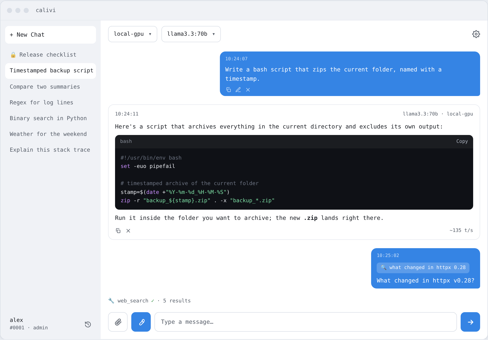

# calivi

A self-hosted, multi-user chat interface for Ollama and OpenAI-compatible servers.
You pick which model runs where: the server first, then the model on it.

Your own GPU box, Ollama Cloud, OpenRouter, Moonshot, LM Studio, vLLM,
llama.cpp-server — all from the same chat window.

<p align="center">
  <picture>
    <source media="(prefers-color-scheme: dark)" srcset="docs/images/app-dark.png">
    
  </picture>
</p>

<p align="center"><sub>The interface, rendered with placeholder data — not a real conversation.</sub></p>

```
┌──────────────┐     ┌──────────────┐     ┌────────────────────────┐
│   Browser    │────▶│ nginx (:8090)│────▶│ FastAPI backend        │
└──────────────┘     │  SPA + /api  │     │  SQLite · tool loop ·  │
                     └──────────────┘     │  approvals             │
                                          └───────────┬────────────┘
                                                      │
              ┌───────────────┬───────────────────────┼───────────────┐
              ▼               ▼                       ▼               ▼
        Ollama servers  OpenAI-compatible      SearXNG (bundled)   MCP servers
        (LAN / remote)  API (cloud / local)    web search          ├─ HTTP, direct
                                                                   └─ stdio, through
                                                                      the sandboxed
                                                                      bridge container
```

> ### ⚠️ Heavy development — use at your own risk
>
> Calivi is what I use daily, but it is at `0.x`: defaults change, the database schema moves,
> and security holes get found and closed as the code does. Read the [CHANGELOG](CHANGELOG.md)
> before upgrading, and **keep your own backups.**

---

## Highlights

- **Multi-server, manual selection** — You choose the server and model from the top bar; no
  automatic routing. `ollama` (native `/api/chat`) and `openai` (`/v1/chat/completions`)
  servers side by side; only reachable ones appear in the picker.
- **Streaming with reasoning** — Responses stream in; reasoning models' thinking tokens
  are shown in a separate box. Interrupt with the **Stop** button or **Esc** (whatever
  was generated so far is kept).
- **Multi-user** — httpOnly cookie + JWT sessions, admin/user roles. Each user sees only
  their own chats. Registration can be closed by an admin.
- **Vision and documents** — Images (paste from clipboard works) go to vision-capable models;
  PDF / docx / txt / code / csv / json are extracted as **text** and handed to the model.
- **Tools (🔧)** — One toggle in the composer offers the tool layer to the model, which then
  calls tools *on its own initiative*; which tool ran is visible in the conversation and
  survives a reload. Bundled SearXNG provides web search.
- **MCP servers** — Connect [Model Context Protocol](https://modelcontextprotocol.io) servers
  (Context7, GitHub, Exa…) and their tools become available to the model alongside the built-in
  ones. HTTP servers directly; stdio servers through a bundled, sandboxed bridge container.
- **Approval before anything changes** — Read-only tools run on their own; a tool that can change
  something is **off until an admin enables it**, and can be set to ask before every run.
- **Secrets encrypted at rest** — MCP tokens and provider API keys are encrypted in the database,
  so a copy of it (a backup, a stolen volume) does not hand over your credentials.
- **Long chats** — Compact a long conversation on demand: older turns are summarised by a model
  you pick, so the whole history is not re-sent on every turn. The messages stay in the chat, and
  "View summary" shows exactly what the model is working from.
- **Message editing** — Edit a message and either **Update** (regenerate from there, optionally on
  a different model) or **New chat** (branch while keeping history).
- **Every answer accounted for** — Each reply keeps the model, the server and the tokens/sec it
  ran at, across reloads. Copy one answer or the whole chat in one click.
- **Phone layout** — Below 768px the chat list and the chat become separate full-screen views,
  with the back gesture working as you would expect.
- **Markdown + math**, **9 languages** (TR, EN, DE, ES, IT, PT, RU, JA, ZH), **light/dark theme**
  with a selectable accent color.

---

## Installation

**Requirements:** Docker and Docker Compose. Nothing else.

```bash
git clone https://github.com/orkun-soylu/calivi.git
cd calivi
docker compose up -d --build
```

Open **http://localhost:8090** (or the host's LAN address: `http://192.168.x.x:8090`).

Or let a coding agent do it: paste the [setup prompt](https://calivi.ai/prompt)
([raw](docs/setup-prompt.txt)) into Claude Code, Codex or similar. It inspects the machine,
installs what is missing, writes `.env`, starts the stack and verifies it — without touching an
existing install's data or key, and leaving the admin account for you to create.

> **The first person to sign up becomes the admin.** Create the first account from the
> registration screen — it is the **super admin** (id 1) and cannot be deleted or
> demoted. Later sign-ups become regular users; you can close registration entirely
> under Settings → General.

**Updating:** read the [CHANGELOG](CHANGELOG.md) first — it flags schema changes — then
`git pull && docker compose up -d --build`. Migrations run on startup.

### calivi-vm — a VM the model can operate

A Proxmox image that boots straight into Calivi on port 80 and lets the chat model **run
commands on that VM**: bash plus file read, write and edit, like a terminal coding agent, behind
approval cards for anything destructive. The first account claims the machine with a setup code
shown on the VM console, and it also becomes the VM's sudo-capable Linux account. See
[`appliance/README.md`](appliance/README.md).

### Adding a server

Settings (⚙) → **Servers** → use the form at the bottom:

| Type | Fields | Example |
|---|---|---|
| `ollama` | host + port | `192.168.1.50` : `11434` |
| `openai` | base URL + API key | `https://openrouter.ai/api/v1` |

The model list is fetched automatically (`/api/tags` or `/v1/models`). A green light on
the row means the server is reachable; red servers are hidden from the chat picker.

> **Ollama must be reachable over the network.** By default Ollama listens only on
> `127.0.0.1`. To reach it from another machine, run it with `OLLAMA_HOST=0.0.0.0`.

### Adding an MCP server

Settings (⚙) → **MCP** → presets for Context7, GitHub and Exa prefill the URL and the auth
header, or fill the form yourself. A green light means the handshake succeeded; the row
expands to show which tools were registered — each with a checkbox, so individual tools can be
switched off without removing the server.

Turn the **🔧 toggle** on in the composer for any of it to reach the model: it gates the whole
tool layer, web search and MCP alike.

| Server | URL | Auth |
|---|---|---|
| Context7 | `https://mcp.context7.com/mcp` | `CONTEXT7_API_KEY` header — optional, raises rate limits |
| GitHub | `https://api.githubcopilot.com/mcp/readonly` | `Authorization: Bearer <PAT>` |
| Exa | `https://mcp.exa.ai/mcp` | `Authorization: Bearer <key>` |

Transport is **HTTP** — either Streamable HTTP or the older HTTP+SSE (pick `SSE` for servers
like Linear that still serve it). For stdio servers (`npx …`), see below.

### stdio MCP servers — the bundled bridge

Calivi never runs stdio servers itself: that would execute an npm or PyPI package named in a web
form inside the backend container, next to the database and the session key. A bundled, opt-in
bridge container runs them instead and speaks HTTP to Calivi.

```bash
cp stdio-bridge/servers.example.json stdio-bridge/servers.json
# add your servers to stdio-bridge/Dockerfile (pinned) and to servers.json
docker compose --profile stdio-bridge up -d --build
```

Then add it in Settings → MCP like any other server, transport **HTTP**, no secret:

```
http://calivi-mcp-bridge:8096/servers/time/mcp
```

The example ships `mcp-server-time`, which answers the question models are worst at — what the
date is right now.

**Servers are installed into the image, pinned** (`stdio-bridge/Dockerfile`). Do not put
`npx -y <package>` in the config: that runs whatever the registry serves at call time.

> **⚠️ The bridge runs code Calivi does not control,** so it is locked down: an `internal: true`
> network (**no internet, no LAN**), non-root, read-only filesystem, no capabilities, no published
> port. A server that needs the internet (`mcp-server-fetch`) **will not work** until you remove
> `internal: true` from the `mcp-bridge` network — which opens your LAN too, unless you add a
> `DOCKER-USER` firewall rule. Decide it deliberately.

> **⚠️ Only read-only tools are offered by default.** A tool runs on its own only if the server
> marks it read-only (`readOnlyHint`); anything else starts **off** — which is also why a bridged
> server can show **no tools** (`mcp-server-fetch` sets no hint). Switch tools on per tool in the
> MCP tab: `auto` to let it run, or **`approve`** to have it ask before every run. Silence is a
> denial, never consent.
>
> That mark is the *server's own claim* — a filter, not a sandbox. **Give MCP servers
> least-privilege credentials** (e.g. a fine-grained, read-only GitHub token; the GitHub preset
> uses the `/readonly` endpoint). Adding an MCP server is admin-only, and its tools become
> available to **every user** of the instance.

### Configuration (environment variables)

Everything has a sensible default. To override, create a `.env` file in the project root
(Compose reads it automatically):

```bash
# .env
CALIVI_PORT=8090        # exposed port
COOKIE_SECURE=false     # set to true behind HTTPS — see the warning below
CALIVI_SECRET_KEY=...   # signs sessions AND encrypts stored secrets — see the note below
```

> ### Set `CALIVI_SECRET_KEY` if you back up the data volume
> Unset, the key is generated into `/data/secret_key`, next to `calivi.db` — so a copy of the
> volume lets its holder sign in as anyone *and* decrypt the stored MCP tokens and API keys.
> Generate one with `openssl rand -hex 32` and put it in `.env`.
>
> **Changing it** signs everyone out and makes stored secrets unreadable. To keep them, start
> once with the previous key as `CALIVI_SECRET_KEY_OLD`: every secret is re-encrypted under the
> new key, then remove the variable. Skip this and the secrets just have to be re-entered.

Other variables (`backend/app/config.py`):

| Variable | Default | |
|---|---|---|
| `OLLAMA_CHAT_TIMEOUT` | `300` | Seconds of stream silence allowed — raise it for very large prompts ([why](ARCHITECTURE.md#long-prompts-and-the-streaming-timeout)) |
| `COMPACT_SUGGEST_TOKENS` / `COMPACT_KEEP_TURNS` | `16000` / `4` | When a chat suggests [compaction](ARCHITECTURE.md#conversation-compaction), and how many recent turns stay verbatim |
| `LOGIN_MAX_ATTEMPTS` / `LOGIN_WINDOW_SECONDS` | `5` / `900` | Per-account login rate limit |
| `REGISTER_MAX_SUCCESS` / `REGISTER_WINDOW_SECONDS` | `10` / `3600` | Sign-up rate limit |
| `CORS_ORIGINS` | `http://localhost:5173` | Only needed for the separate dev server |
| `DB_PATH`, `SEARXNG_URL`, `*_PATH` | | Data and config locations — see `config.py` |

> ### ⚠️ Behind HTTPS, set `COOKIE_SECURE=true`
> The default is `false` because Compose serves plain HTTP. Behind a TLS proxy (Traefik, Caddy,
> nginx…) set it to `true`, or the session cookie goes out without the `Secure` flag. The reverse
> is a trap too: `true` over plain HTTP makes **login fail silently** — it may still work on
> `http://localhost`, which browsers treat as secure, and then break from a LAN address.

---

## Configuration files

The YAML files under `config/` are mounted into the container and re-read on every
request — **no restart needed**. Most are also editable from the Settings UI.

| File | Purpose |
|---|---|
| `config/system_prompts.yml` | Per-model system prompts (the `default` key is the fallback) — **not in git**, see below |
| `config/tools.yml` | Tool (function-calling) layer: on/off, loop cap, `web_search` options |
| `config/search.yml` | Web search: query-generation prompt, result count |
| `config/vision_models.yml` | Manual overrides for vision detection (`force_vision` / `force_text`) |
| `searxng/settings.yml` | Bundled SearXNG. No port is exposed; change `secret_key` if you expose it publicly |

`config/system_prompts.yml` is **git-ignored**: system prompts tend to name your own
hardware and models, and they are the one config that is genuinely personal. Start from
the example:

```bash
cp config/system_prompts.example.yml config/system_prompts.yml
```

Running without it is fine too — no system message is sent, and the Settings →
System Prompts editor creates the file when you first save. The "Default" button in that
editor restores the factory defaults from `backend/app/defaults/system_prompts.yml`.

---

## Backups

All user data (`calivi.db` plus the session signing key) lives in a named volume called
`calivi-data` — not a bind mount.

```bash
docker compose stop calivi-backend
VOL=$(docker volume inspect calivi_calivi-data --format '{{.Mountpoint}}')
sudo tar czf calivi-backup-$(date +%F).tar.gz --numeric-owner -C "$VOL" .
docker compose start calivi-backend
```

Use `--numeric-owner` when restoring: `calivi.db` and `secret_key` belong to different
users.

---

## Development

```bash
# Frontend (vite dev server on :5173)
cd frontend && npm install && npm run dev
npm test                    # vitest + jsdom

# Backend
cd backend
python3 -m venv .venv-test && ./.venv-test/bin/pip install -r requirements-dev.txt
./.venv-test/bin/pytest     # real HTTP layer (httpx ASGITransport), no live server needed
./.venv-test/bin/uvicorn app.main:app --reload --port 8000
```

When the backend runs separately, the frontend is served from a different origin
(`:5173`), so `CORS_ORIGINS` comes into play — it already defaults to
`http://localhost:5173`.

**See [`ARCHITECTURE.md`](ARCHITECTURE.md) for architecture, design decisions and known
pitfalls** — the component map, tool loop, security notes and "don't fall into this again"
warnings live there.

---

## Built with

**Backend:** FastAPI · SQLAlchemy · SQLite · httpx · PyJWT · bcrypt
**Frontend:** React · Vite · Tailwind · react-markdown · KaTeX
**Deployment:** Docker Compose (backend + nginx/frontend + SearXNG)

---

## Security

Found a vulnerability? Please report it privately — see [SECURITY.md](SECURITY.md).

Calivi is designed as a single-tenant application running on your own network. Before
exposing it directly to the internet, know that:

- Web search results and document attachments are treated as **untrusted content** and
  passed to the model inside delimited blocks (prompt-injection defence).
- The frontend is served with a strict Content-Security-Policy; remote images in model
  output are not fetched (a data-exfiltration vector).
- Login attempts are rate-limited per account (default: 5 attempts / 15 minutes).
- Tools that can change state are **off by default** (see [MCP](#adding-an-mcp-server)).

---

## Contributing

Contributions are welcome — see [CONTRIBUTING.md](CONTRIBUTING.md).

Commits must be signed off under the [DCO](DCO) (`git commit -s`). There is no CLA.

## License

[MIT](LICENSE) © 2026 Orkun Soylu

Icons by [Lucide](https://lucide.dev) (ISC). Typeface: JetBrains Mono Nerd Font
(SIL OFL 1.1). Full attribution for bundled third-party assets is in
[THIRD-PARTY-NOTICES.md](THIRD-PARTY-NOTICES.md).
